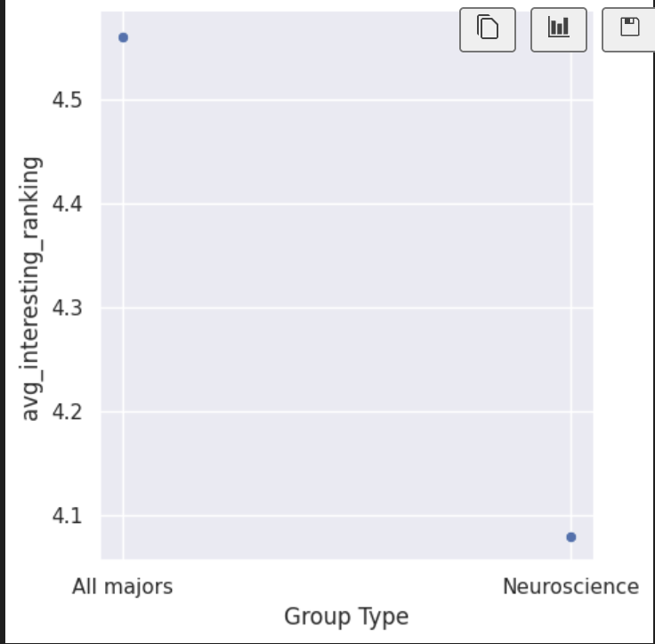
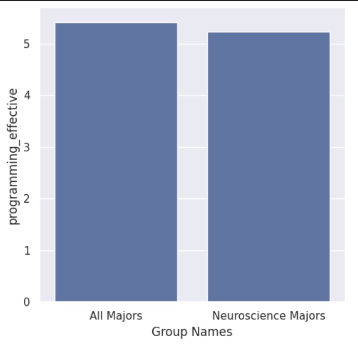

---
# Do not edit the text between these lines!
layout: default
---

# This is a big header

<!-- This is a comment. Below, you'll see code for inserting an image. To make this image appear, update <custom-path>. To add an image, save it inside the imgs folder of this repository. -->
/static/imgs/logo.png" alt="Image of Comp110 rainbow logo. "  width="500"/>

## EX09 Analysis

My 5 ideas to analyze were as following:
1. The course should include examples from Neuroscience because there are a large number of NSCI majors taking this course.
2. The course should use code that is related to biology because a large number of biology majors take this course.
3. The course should teach more in depth about early topics because a substantial amount of students have None to less than 2 months of coding experience.
4. The course should include optional view pre-lecture videos because those with less coding experience may benefit from a quick introduction before lecture.
5. This course should slow down the pace for content because first time and minimal experience coders may struggle with initial concepts.

The idea I chose to analyze was: The course should include examples from Neuroscience because there are a large number of NSCI majors taking this course.

I chose this because: There is a concrete number of neuroscience majors who are taking the course, and it is one of the largest populations of students taking this course, followed by biology.

First Graph: I found the avergae interest rates in class content for all majors and compared to Neuroscience majors.

Second Graph: I displayed the counts of several majors, including Neuroscience Majors in the COMP110 course.

Third Graph: I compared the responses to programming_effective of all majors to Neuroscience Majors.

Conclusion:
I believe that my data analysis is either inconclusive or does not support my idea because the differences between Neuroscience Majors and other groups are not very large. For example, the differences between all majors and NSCI majors on average interestingness is only tenths away from each other. In my third visualization, the difference in finding the programming assignments effective is very small between all majors versus neuroscience majors. Upon reflection, I think my data is inconclusive because I would need to know if there is a statistically significant difference between the group comparisons because the differences are so small. To better understand this, we could collect data specifically asking the question, "Do you think you would find the assignments more effective if the content pertained to your major?" or the same question but with finding ti interesting. Doing this code writing and visualization after these questions may yield more clear results. Potential costs for this topic area would be that changing course content may not really align with the skills and methods taught at that time, moreover, the data may be too advanced for the beginning part of this course. This would be a trade-off: more interesting material for a good chunk of the class, but it may be too advanced for the time being. Stakeholders that may be negatively affected by this change are all the other majors that aren't neuroscience that have to complete assignments pertaining to this subject area and don't find it interesting.