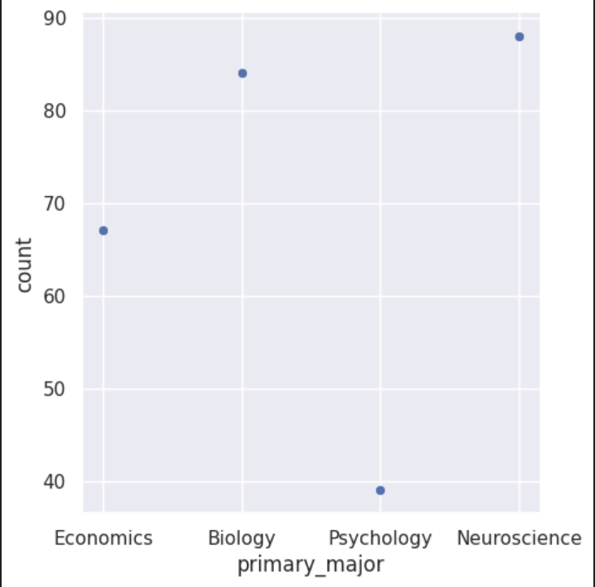

---
# Do not edit the text between these lines!
layout: default
---

# This is a big header

<!-- This is a comment. Below, you'll see code for inserting an image. To make this image appear, update <custom-path>. To add an image, save it inside the imgs folder of this repository. -->
/static/imgs/logo.png" alt="Image of Comp110 rainbow logo. "  width="500"/>

## EX09 Analysis

My 5 ideas to analyze were as following:
1. The course should include examples from Neuroscience because there are a large number of NSCI majors taking this course.
2. The course should use code that is related to biology because a large number of biology majors take this course.
3. The course should teach more in depth about early topics because a substantial amount of students have None to less than 2 months of coding experience.
4. The course should include optional view pre-lecture videos because those with less coding experience may benefit from a quick introduction before lecture.
5. This course should slow down the pace for content because first time and minimal experience coders may struggle with initial concepts.

The idea I chose to analyze was: The course should include examples from Neuroscience because there are a large number of NSCI majors taking this course.

I chose this because: There is a concrete number of neuroscience majors who are taking the course, and it is one of the largest populations of students taking this course, followed by biology.

First Graph: I found the avergae interest rates in class content for all majors and compared to Neuroscience majors.

Second Graph: I displayed the counts of several majors, including Neuroscience Majors in the COMP110 course.

Third Graph: I compared the responses to programming_effective of all majors to Neuroscience Majors.
